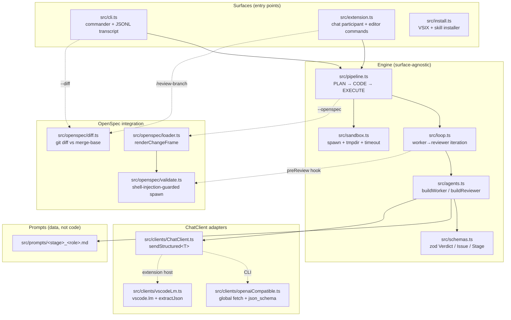
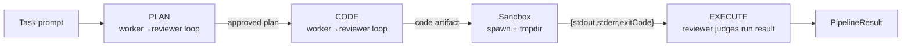
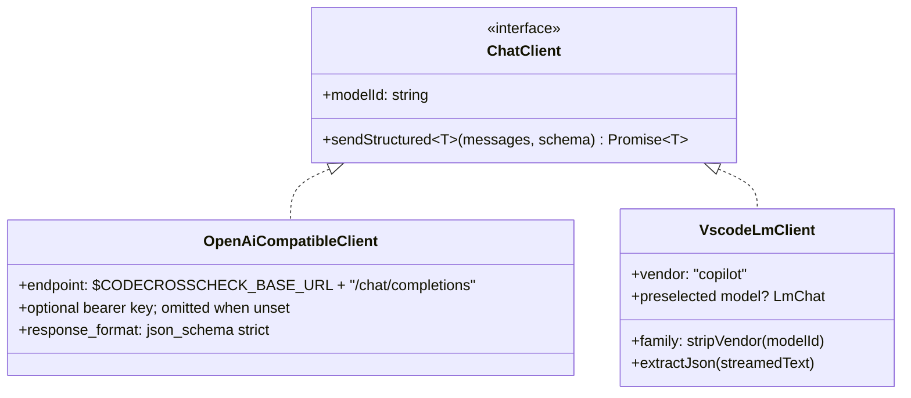
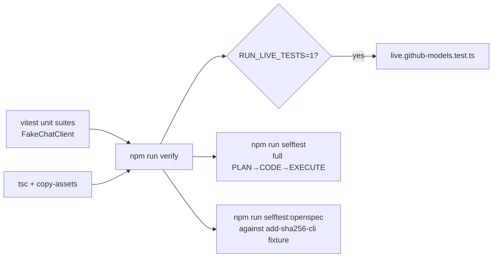

# CodeCrossCheck — Architecture

> Companion to [README.md](../README.md). The README is the user-facing doc;
> this file explains how the tool is built and why.

## 1. The premise

A single LLM reviewing its own work has shared blind spots. CodeCrossCheck is
a small, framework-free TypeScript loop where a **worker** model produces an
artifact (plan, code, or execution log) and a **reviewer** model from a
**different vendor** judges it against a structured verdict schema. The loop
iterates until the reviewer approves or an iteration cap is hit.

The same engine drives two surfaces:

- a Node CLI (`codecrosscheck` / `ccc`)
- a VS Code extension exposing the `@codecrosscheck` chat participant

Optional **OpenSpec mode** (`--openspec <change-id>`) injects a change frame
into the reviewer's context and runs `openspec validate --strict` as a
deterministic pre-gate before each reviewer call.

## 2. Component view



Two key invariants:

- **Engine doesn't know about VS Code.** `pipeline.ts`, `loop.ts`, `agents.ts`,
  `sandbox.ts`, and `schemas.ts` import only Node + zod. The `vscode` module
  is a `peerDependency` and is touched only by `src/extension.ts` and
  `src/clients/vscodeLm.ts`.
- **Worker and reviewer are interchangeable.** Both are `ChatClient`
  consumers; the only difference is the prompt and the role name passed to
  `agents.ts`. The cross-vendor invariant lives in **configuration**
  (different model ids), not in code.

## 3. One iteration in detail

```mermaid
sequenceDiagram
  autonumber
  participant Pipeline as pipeline.ts
  participant Loop as loop.ts (reviewLoop)
  participant Worker as Worker (LLM A)
  participant Validator as openspec validate --strict<br/>(optional pre-gate)
  participant Reviewer as Reviewer (LLM B)
  participant Sink as onEvent → JSONL / chat stream

  Pipeline->>Loop: stageInput, { worker, reviewer, preReview }
  loop until approve or maxIters
    Loop->>Worker: produce(input)
    Worker-->>Loop: artifact (text)
    Loop->>Sink: type:"worker", iteration, modelId
    opt preReview hook (OpenSpec mode)
      Loop->>Validator: spawn (changeId regex-validated)
      alt validator passes
        Validator-->>Loop: null (continue to reviewer)
      else validator fails
        Validator-->>Loop: synthesized Verdict<br/>{verdict:"revise", issues:[...]}
        Note over Loop,Reviewer: Reviewer SKIPPED — zero tokens spent
      end
    end
    alt no synthesized verdict
      Loop->>Reviewer: judge(artifact)
      Reviewer-->>Loop: Verdict (zod-validated JSON)
    end
    Loop->>Sink: type:"verdict", source:"model"|"validator"
    alt verdict.verdict == "approve"
      Loop-->>Pipeline: { approved:true, iterations:i, artifact }
    else
      Loop->>Loop: buildRevisionInput(task, artifact, issues)
    end
  end
  Loop-->>Pipeline: { approved:false, iterations:maxIters }
```

Key behaviours encoded in [src/loop.ts](../src/loop.ts):

- **Single-retry on malformed JSON.** `ChatClient.sendStructured` retries once
  with a stricter system message before failing. Two consecutive malformed
  responses fail the iteration with a descriptive error that now includes a
  160-char snippet of each raw response so schema drift can be diagnosed
  from chat output alone.
- **Refusal short-circuit.** Before either parse attempt,
  `sendStructured` (both transports) checks the raw response against a
  conservative refusal-pattern list. When a content-policy refusal is
  detected, it throws a `ModelRefusalError` carrying the model id and a
  truncated response snippet, and *skips* the schema-reminder retry — a
  model that refused on attempt 1 will refuse on attempt 2. The
  fence-extraction regex is also strict: only `json`-labelled or
  unlabelled fences are unwrapped, so a ` ```text\nSorry...\n``` `
  refusal cannot masquerade as JSON. See OpenSpec change
  `fix-model-refusal-detection`.
- **Oversized-prompt short-circuit.** Token-limit / context-window
  failures from the underlying LM (`Message exceeds token limit`,
  `maximum context length`, `prompt is too long`, `request too large`,
  `context window exceeded`) are detected in both transports' catch
  blocks and rethrown as a typed `OversizedPromptError` *without*
  triggering the schema-reminder retry. `/review-branch` adds two
  upstream guards: a hard char-budget cap
  (`codecrosscheck.reviewBranch.maxDiffChars`, default 1.1 M chars) and a
  best-effort `countTokens` preflight against the reviewer model's
  `maxInputTokens` (with a 10% response reserve). The cap now sits above
  every reachable model's context window, so the preflight is normally the
  gate that fires; the cap still covers models reporting no
  `maxInputTokens`. See OpenSpec changes
  `guard-oversized-review-prompts` and `raise-review-branch-diff-budget`.
- **Revision prompts include structured issues, not raw reviewer prose.**
  `buildRevisionInput` formats `severity / where / why / suggestion` so the
  worker sees machine-actionable feedback.
- **Validator pre-gate short-circuits with zero reviewer tokens.** When
  `openspec validate --strict` fails, the synthesized verdict carries the
  validator's error as a `severity: "high"` issue and the reviewer is never
  called for that iteration.

## 4. Pipeline (PLAN → CODE → EXECUTE)

[src/pipeline.ts](../src/pipeline.ts) chains three stages. Each stage is its
own `reviewLoop` invocation; output of stage N becomes input to stage N+1.



- **PLAN reviewer** flags scope clarity, missing edge cases, missing
  verification plan.
- **CODE reviewer** names OWASP A01–A10 explicitly, enforces boundary-only
  error handling and no-over-engineering.
- **EXECUTE reviewer** judges sandbox output, not source code: exit code,
  expected stdout markers, suspicious stderr signals.

`opts.stages` lets callers run a subset (`--stages plan` or `/plan`).

### 4.1 How a `/review-branch` dialogue ends

`/review-branch` does not use `runPipeline`; it drives its own
reviewer→triage→worker→reviewer dialogue and classifies the ending into exactly
one `ReviewOutcome`. The distinction matters because three of these look like
success and only one is an approval of a fix:

| Outcome | Meaning | Rendered as |
|---|---|---|
| `approved` | The reviewer returned `verdict: "approve"` on its own. | ✅ Approved |
| `defended` | Triage could not confirm a single remaining finding, so nothing was drafted. **The code was defended against the findings** — a different claim from "the fix is good". | 🛡️ Findings did not survive triage, with the evidence for each rejection |
| `rebutted` | Every outstanding finding matched a fingerprint the worker had rebutted with `status: "disagree"`, so the filter emptied the list. **The reviewer never approved.** | 🤝 Stalled on disagreement, with the rebuttals listed for the user to adjudicate |
| `exhausted` | `maxIters` reached with findings still open. | ⚠️ Did not converge |
| `cancelled` | The request's `CancellationToken` fired. | ⏹️ Cancelled |
| `failed` | Diff could not be computed, budget exceeded, or a model call failed. | ❌ with `ChatResult.errorDetails` |

`defended` and `rebutted` both mean "no fix was produced", but they arrive
differently: `rebutted` is the worker declining while drafting, recovered by
parsing prose; `defended` is a dedicated triage pass returning a schema-validated
judgement with evidence, before any drafting happens.

`rebutted` exists because of a real defect: `filterRejectedIssues` used to flip
the verdict to `approve` when suppression emptied the issue list, and the
summary then printed "Approved — reviewer is satisfied". That let the *worker*
self-certify by disagreeing, in a tool whose entire premise is that a second
model judges the first. The helper is now side-effect free and reports
`emptiedBySuppression`; the handler decides the outcome and the renderer never
shows an approval the reviewer did not give.

The outcome is written to the terminating `review-branch-done` transcript
event and returned in `ChatResult.metadata`, which is what drives the
followups (`apply`, `force-fix-all`, `raise the cap`).

## 5. Sandbox

[src/sandbox.ts](../src/sandbox.ts) is the only place that runs untrusted
code. Guarantees:

| Guarantee | Mechanism |
|---|---|
| No shell interpolation | `child_process.spawn` with arg array, no `shell: true` |
| Fresh working dir per run | `fs.mkdtempSync(path.join(os.tmpdir(), "ccc-"))` |
| Env scrubbed to allowlist | `PATH`, `LANG`, `TMPDIR`/`TEMP`, `HOME`/`USERPROFILE` only |
| Hard timeout | Default 30 s; process tree killed on expiry |
| Cleanup | `rm -rf` of tmpdir on completion (success or failure) |

The sandbox is **not** an adversarial isolator. Treat it as a guardrail
against accidents, not a substitute for a container or VM. This is documented
inline in [src/sandbox.ts](../src/sandbox.ts) and in the README's Security
notes.

## 6. ChatClient adapters



- **`openaiCompatible.ts`** is what the CLI uses. It sends OpenAI-style
  `response_format: { type: "json_schema" }` derived from the zod schema via
  zod 4's native `z.toJSONSchema()`. `strict` is declared only when the
  generated schema actually satisfies strict mode (every property required,
  `additionalProperties: false`), because declaring it otherwise makes the
  provider reject the request. HTTP goes through the platform `fetch`.
  There is deliberately no default base URL: the previous client hard-coded
  GitHub Models, and when that service was retired on 2026-07-30 every CLI
  invocation broke. The API key is optional so keyless local servers work.
- **`vscodeLm.ts`** is what the extension uses. `vscode.lm` wants a `family`
  string (`"claude-opus-5"`), not a vendor-prefixed id
  (`"anthropic/claude-opus-5"`); the
  client strips the vendor with `stripVendor()`. It also accepts a
  pre-resolved `LmChat` so the extension can pass `request.model` (the
  Copilot Chat picker selection) without re-resolving.
- Both retry **once** on a parse or schema failure, and the retry includes the
  model's own failed response as an assistant turn plus the validation error.
  A reminder that names a schema without stating it gives the model nothing to
  correct against.
- Both accept an `AbortSignal`. `VscodeLmClient` creates one
  `CancellationTokenSource` per call, cancels it from the signal, and disposes
  it in a `finally`.

The two model-id formats are why the extension surfaces both
`codecrosscheck.workerModel` (full id, for fallback resolution) and
`codecrosscheck.useChatPickerWorker` (boolean, for picker passthrough).
Both `workerModel` and `reviewerModel` are free-text settings; the
**CodeCrossCheck: Pick Worker and Reviewer Models** command populates them
from `vscode.lm.selectChatModels()` so the list cannot go stale. All settings
are read through [src/config.ts](../src/config.ts), which holds exactly one
default per setting; `test/config.test.ts` asserts those match the manifest.

## 7. OpenSpec mode

When `--openspec <change-id>` is set (CLI) or
`/openspec-review <change-id>` is invoked (chat), three things happen:

1. **Change frame injection.** [src/openspec/loader.ts](../src/openspec/loader.ts)
   reads `proposal.md`, `tasks.md`, and `specs/**/spec.md` for the change
   and renders them into a structured frame appended to the reviewer system
   prompt. Both PLAN and CODE reviewer prompts have an "OpenSpec frame"
   section that activates when this frame is present.
2. **Validator pre-gate.** [src/openspec/validate.ts](../src/openspec/validate.ts)
   spawns `openspec validate --strict <changeId>` before each reviewer call.
   On failure the loop synthesizes a `revise` verdict from validator
   stderr — **zero reviewer tokens spent** on structurally invalid changes.
   `changeId` is regex-guarded (`^[A-Za-z0-9._-]+$`) before spawn because
   the call uses `shell: true` (required on Windows for `.cmd` shims after
   Node 22's CVE-2024-27980 hardening).
3. **Diff scoping.** [src/openspec/diff.ts](../src/openspec/diff.ts)
   computes `git diff` against the merge-base with `origin/main` **and the
   working tree**, so staged and unstaged edits to tracked files are reviewed;
   untracked files are excluded. Pass `committedOnly` (CLI `--committed-only`,
   chat `committed-only`) to compare commits alone. It returns the patch plus a
   description of what was compared, which `/review-branch` prints in its
   header. The helper chunks per-file with overlap to stay under context
   limits, and backs the CLI's `--diff` flag and the `/review-branch` command.

## 8. Surfaces

### 8.1 CLI ([src/cli.ts](../src/cli.ts))

- `commander` with positional `<task>` and flags documented in the README.
- JSONL transcript writer: one event per `PipelineEvent` to
  `.codecrosscheck/runs/<ISO-timestamp>.jsonl`. Includes worker drafts,
  verdicts (with `source: "model" | "validator"`), sandbox results, and
  the final `completed` record.
- Exit 0 if final stage `approved`, else 1. There is no dispatcher teardown
  step: the client uses the platform `fetch`, so the `undici` keep-alive pool
  that used to need closing on Windows is gone.

### 8.2 VS Code extension ([src/extension.ts](../src/extension.ts))


- **`request.model` integration.** When `useChatPickerWorker` is `true`, the
  worker `VscodeLmClient` is constructed with `request.model` (the Copilot
  Chat picker selection). The reviewer always uses
  `codecrosscheck.reviewerModel`. If both resolve to the same model id, the
  participant streams a warning before running the loop.
- **`/review-branch [extra]`** runs a dedicated reviewer-first dialogue
  loop (not `runPipeline`). Iteration 1 calls the CODE reviewer directly
  on the diff. Iterations 2..N triage the findings, then call the worker with
  the [`review_branch_fixer`](../src/prompts/review_branch_fixer.md) prompt to
  produce concrete fixes for the confirmed findings, then have the reviewer
  re-judge whether those fixes resolve the issues. The fixer returns a
  schema-validated `FixProposal` — one entry per finding carrying a status, an
  explanation and exact edits — and the Markdown shown to the user and sent to
  the reviewer is *derived* from that structure, so prose and edits cannot
  disagree.
  - **Workspace toolset.** The triager and the fixer are given a read-only
    toolset (`read_file`, `search_workspace`, `list_directory`) from
    [`src/tools/workspaceTools.ts`](../src/tools/workspaceTools.ts) and fetch
    what they need mid-turn. This replaced a pre-computed harvesting pass:
    measured on the 2026-09-16 dogfood run, the file the triager turned out to
    need was named nowhere in the finding, so no amount of pre-computation
    could have supplied it. Every path is validated with `resolveSafePath`,
    filtered through a denylist (VCS metadata, build output, dependency trees,
    credential files) and then through `git check-ignore` when the workspace is
    a repository. Each loop is bounded by `codecrosscheck.tools.maxCalls` and
    `codecrosscheck.tools.deadlineMs`; on exhaustion the client withdraws the
    tools, tells the model so, and takes one final answer. Every call is
    streamed to the user and written to the transcript as a `tool-call` event.
  - **Worker disagreement adjudication.** A fix with status `disagree` is a
    push-back, and its `explanation` is the rebuttal. After the final iteration
    the handler renders any rebuttals at the end of the chat output as a
    numbered, blockquoted decision block. The user adjudicates by accepting
    (run `/apply-review` — a rebutted finding carries no edits) or overriding:
    re-run with `force-fix-all` anywhere in the prompt (whole-word,
    case-insensitive) to append a `# User override` section that requires a
    concrete fix for every finding and withdraws the `disagree` status.
  - **Unaddressed findings.** A fix with status `unaddressed` is one the worker
    could neither fix nor rebut. These are rendered as a separate
    `🚫 N finding(s) the worker could not produce a patch for` block quoting
    the worker's own reason. This replaced a set of English-phrase regexes
    (`**Data I need`, `pending current source`) that had obvious false
    positives in ordinary prose.
  - **Reviewer exhaustiveness and complete-round rule.** The reviewer
    prompt requires every finding to be listed (high → low →
    file/line) with no arbitrary cap. The fixer prompt requires each
    round to be a complete, self-contained proposal: any edit from
    round N that is still needed must be repeated verbatim in round
    N+1, since `/apply-review` consumes only the final round.
  - **Per-invocation iteration cap.** The handler parses
    `max-iters=N` / `maxiters=N` / `iters=N` (whole-token,
    case-insensitive, range 1..20) from the user prompt and overrides
    `codecrosscheck.maxIters` for that invocation only.
  - **Summary discoverability.** When the run does not converge, the
    summary clarifies that residual reviewer findings target the
    **proposal**, not the original branch, and whenever a fix
    proposal exists (converged or not) the summary points the user at
    `/apply-review`. The manual-only fallback only renders when no
    proposal exists at all.
- **`/apply-review`** is the apply step of the review loop and
  lives in a dedicated handler in
  [`src/extension.ts`](../src/extension.ts) backed by the pure
  [`src/applyReview.ts`](../src/applyReview.ts) module. Flow: locate the
  newest `.codecrosscheck/runs/*.jsonl` containing a `review-branch-done`
  event → extract the structured proposal from the last
  `review-branch-iter` event with `role: "worker"` → for each edit, validate
  the path resolves under the workspace root, require `oldString` to occur
  exactly once byte for byte, then write via `vscode.workspace.fs`. **It calls
  no model.** The second model hop that used to re-derive `oldString` /
  `newString` from Markdown existed only because prose could not be trusted to
  carry exact strings; with structured edits there is nothing to re-derive, and
  with it went the CRLF-and-diff-marker repair machinery — a near-miss now
  means the edit is wrong, and repairing it would hide that. An empty
  `oldString` means create-mode (refuses to overwrite). A transcript written
  before structured proposals is reported as such rather than silently
  applying nothing. Every run persists a debug log at
  `<workspace>/.codecrosscheck/runs/<iso>-apply.json` containing the source
  transcript, the `edits`, and per-edit `outcomes` — linked from chat output
  even on zero-edit runs. Apply is a separate slash command (not part of
  `/review-branch`) so the review loop stays read-only and safe to run on any
  branch; applying is the explicit, opt-in "do it" step. Settings
  `codecrosscheck.applyReview.dryRun` and
  `codecrosscheck.applyReview.testCommand` control preview-only mode and an
  optional follow-up test invocation.
- **`installSkill` command** copies the bundled
  `dist/assets/skills/codecrosscheck-delegate/SKILL.md` to either
  `<workspace>/.github/skills/` or `<homedir>/.agents/skills/`. Refuses
  overwrite without explicit confirmation.

### 8.3 Installers ([src/install.ts](../src/install.ts))

The `codecrosscheck-install` bin (also runnable directly as
`node dist/install.js`) handles one job, selected by `argv[2]`:

- `install skill [--user]`: copies the bundled delegation skill (same
  file the VS Code command writes) into the workspace or user-profile
  skills folder. Works from any local clone with `npm run build`
  completed; no network.

## 9. Prompts as data

Reviewer system prompts live in [src/prompts/](../src/prompts/) as plain
markdown and are copied to `dist/prompts/` at build time
([scripts/copy-assets.mjs](../scripts/copy-assets.mjs)).

- `plan_reviewer.md`, `code_reviewer.md`, `execute_reviewer.md` — each names
  its checklist explicitly (OWASP A01–A10, edge-case taxonomy, exit-code
  handling) and ends with the exact verdict-schema field names. A
  prompt-contract test (`test/prompts.test.ts`) asserts those field names
  are present in every prompt file so a typo can't quietly break the loop.
- `plan_worker.md`, `code_worker.md`, `execute_worker.md` — minimal worker
  personas; they emit the artifact only.

## 10. Verification



- **Unit tests** drive `loop.ts` and `pipeline.ts` with a deterministic
  `FakeChatClient` whose responses are scripted; no network, no
  flakiness. Sandbox tests use real subprocesses but tiny scripts.
- **Live integration test** is gated on `RUN_LIVE_TESTS=1` + `CODECROSSCHECK_BASE_URL`
  and is the only test that touches the network in CI.
- **Selftests** are end-to-end smoke tests run manually with a token. They
  exercise the actual binaries against live GitHub Models, including the
  validator pre-gate path for `selftest:openspec`.

## 11. Distribution

Local-only by design. Two artifacts produced from one repo, both
installed directly from a checkout — no registry, no feed:

| Artifact | Built by | Installed by |
|---|---|---|
| `codecrosscheck` CLI (`bin`: `codecrosscheck`, `ccc`) | `npm run build` | `npm link` from the checkout |
| `codecrosscheck-<ver>.vsix` | `npx vsce package` (see README §4) | `code.cmd --install-extension <path>` |

Neither artifact ships to any registry. `package.json` sets
`"private": true`, which is what stops an accidental `npm publish`.
[scripts/release.mjs](../scripts/release.mjs) is a pre-package gate: it
checks for a clean tree on `main`, the package name, `private`, and a
green `npm run verify`, then tells you to run `vsce package`. It
publishes nothing.

## 12. Self-hosting

From `0.1.0` onward, changes in this repo are reviewed by `@codecrosscheck`
itself in OpenSpec mode (`/openspec-review <change-id>` or
`/review-branch`). The genesis change (`add-codecrosscheck`) and this
session's change (`add-chat-picker-and-delegation`) both live under
[openspec/changes/](../openspec/changes/) and validate clean against
`openspec validate --strict`.
