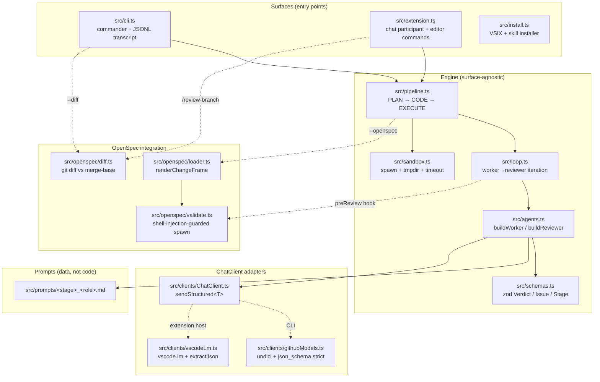
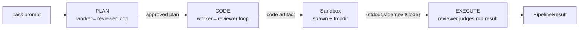
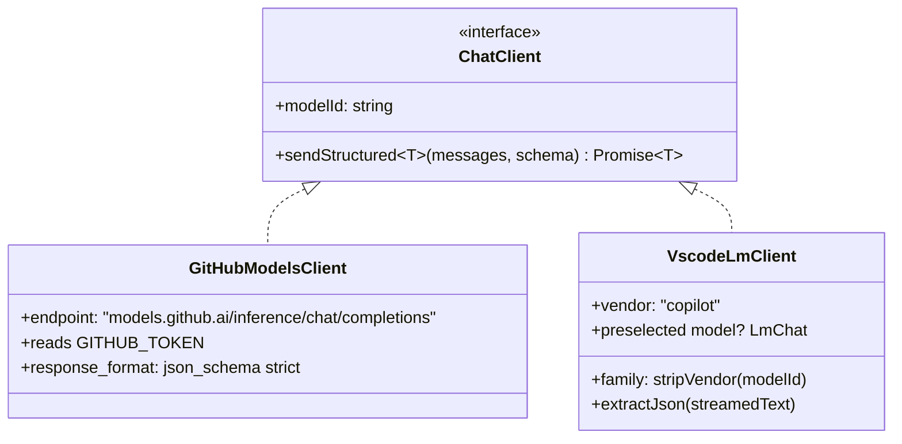
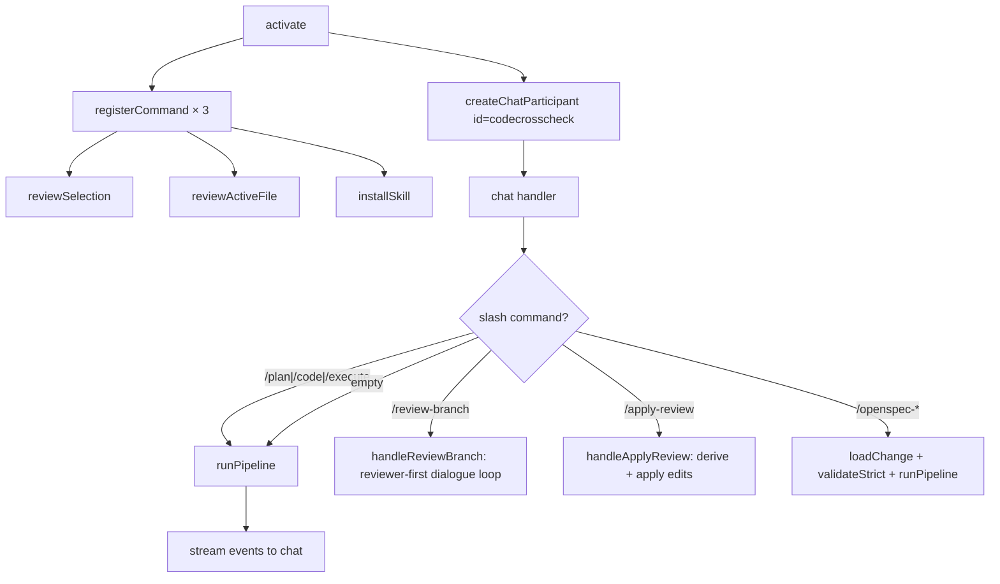
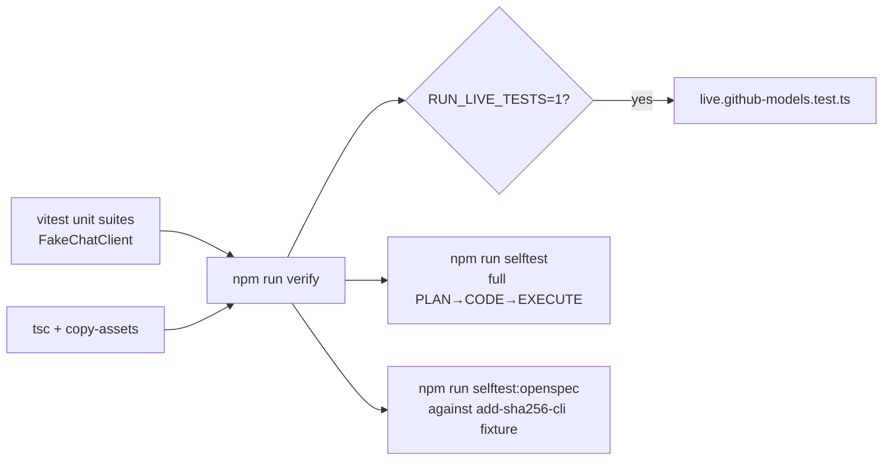

# CodeCrossCheck — Architecture

> Companion to [README.md](../README.md). The README is the user-facing doc;
> this file explains how the tool is built and why.

## 1. The premise

A single LLM reviewing its own work has shared blind spots. CodeCrossCheck is
a small, framework-free TypeScript loop where a **worker** model produces an
artifact (plan, code, or execution log) and a **reviewer** model from a
**different vendor** judges it against a structured verdict schema. The loop
iterates until the reviewer approves or an iteration cap is hit.

The same engine drives two surfaces:

- a Node CLI (`codecrosscheck` / `ccc`)
- a VS Code extension exposing the `@codecrosscheck` chat participant

Optional **OpenSpec mode** (`--openspec <change-id>`) injects a change frame
into the reviewer's context and runs `openspec validate --strict` as a
deterministic pre-gate before each reviewer call.

## 2. Component view



Two key invariants:

- **Engine doesn't know about VS Code.** `pipeline.ts`, `loop.ts`, `agents.ts`,
  `sandbox.ts`, and `schemas.ts` import only Node + zod. The `vscode` module
  is a `peerDependency` and is touched only by `src/extension.ts` and
  `src/clients/vscodeLm.ts`.
- **Worker and reviewer are interchangeable.** Both are `ChatClient`
  consumers; the only difference is the prompt and the role name passed to
  `agents.ts`. The cross-vendor invariant lives in **configuration**
  (different model ids), not in code.

## 3. One iteration in detail

```mermaid
sequenceDiagram
  autonumber
  participant Pipeline as pipeline.ts
  participant Loop as loop.ts (reviewLoop)
  participant Worker as Worker (LLM A)
  participant Validator as openspec validate --strict<br/>(optional pre-gate)
  participant Reviewer as Reviewer (LLM B)
  participant Sink as onEvent → JSONL / chat stream

  Pipeline->>Loop: stageInput, { worker, reviewer, preReview }
  loop until approve or maxIters
    Loop->>Worker: produce(input)
    Worker-->>Loop: artifact (text)
    Loop->>Sink: type:"worker", iteration, modelId
    opt preReview hook (OpenSpec mode)
      Loop->>Validator: spawn (changeId regex-validated)
      alt validator passes
        Validator-->>Loop: null (continue to reviewer)
      else validator fails
        Validator-->>Loop: synthesized Verdict<br/>{verdict:"revise", issues:[...]}
        Note over Loop,Reviewer: Reviewer SKIPPED — zero tokens spent
      end
    end
    alt no synthesized verdict
      Loop->>Reviewer: judge(artifact)
      Reviewer-->>Loop: Verdict (zod-validated JSON)
    end
    Loop->>Sink: type:"verdict", source:"model"|"validator"
    alt verdict.verdict == "approve"
      Loop-->>Pipeline: { approved:true, iterations:i, artifact }
    else
      Loop->>Loop: buildRevisionInput(task, artifact, issues)
    end
  end
  Loop-->>Pipeline: { approved:false, iterations:maxIters }
```

Key behaviours encoded in [src/loop.ts](../src/loop.ts):

- **Single-retry on malformed JSON.** `ChatClient.sendStructured` retries once
  with a stricter system message before failing. Two consecutive malformed
  responses fail the iteration with a descriptive error that now includes a
  160-char snippet of each raw response so schema drift can be diagnosed
  from chat output alone.
- **Refusal short-circuit.** Before either parse attempt,
  `sendStructured` (both transports) checks the raw response against a
  conservative refusal-pattern list. When a content-policy refusal is
  detected, it throws a `ModelRefusalError` carrying the model id and a
  truncated response snippet, and *skips* the schema-reminder retry — a
  model that refused on attempt 1 will refuse on attempt 2. The
  fence-extraction regex is also strict: only `json`-labelled or
  unlabelled fences are unwrapped, so a ` ```text\nSorry...\n``` `
  refusal cannot masquerade as JSON. See OpenSpec change
  `fix-model-refusal-detection`.
- **Revision prompts include structured issues, not raw reviewer prose.**
  `buildRevisionInput` formats `severity / where / why / suggestion` so the
  worker sees machine-actionable feedback.
- **Validator pre-gate short-circuits with zero reviewer tokens.** When
  `openspec validate --strict` fails, the synthesized verdict carries the
  validator's error as a `severity: "high"` issue and the reviewer is never
  called for that iteration.

## 4. Pipeline (PLAN → CODE → EXECUTE)

[src/pipeline.ts](../src/pipeline.ts) chains three stages. Each stage is its
own `reviewLoop` invocation; output of stage N becomes input to stage N+1.



- **PLAN reviewer** flags scope clarity, missing edge cases, missing
  verification plan.
- **CODE reviewer** names OWASP A01–A10 explicitly, enforces boundary-only
  error handling and no-over-engineering.
- **EXECUTE reviewer** judges sandbox output, not source code: exit code,
  expected stdout markers, suspicious stderr signals.

`opts.stages` lets callers run a subset (`--stages plan` or `/plan`).

## 5. Sandbox

[src/sandbox.ts](../src/sandbox.ts) is the only place that runs untrusted
code. Guarantees:

| Guarantee | Mechanism |
|---|---|
| No shell interpolation | `child_process.spawn` with arg array, no `shell: true` |
| Fresh working dir per run | `fs.mkdtempSync(path.join(os.tmpdir(), "ccc-"))` |
| Env scrubbed to allowlist | `PATH`, `LANG`, `TMPDIR`/`TEMP`, `HOME`/`USERPROFILE` only |
| Hard timeout | Default 30 s; process tree killed on expiry |
| Network deny by default | `NO_PROXY=*` injected unless `--allow-network` |
| Cleanup | `rm -rf` of tmpdir on completion (success or failure) |

The sandbox is **not** an adversarial isolator. Treat it as a guardrail
against accidents, not a substitute for a container or VM. This is documented
inline in [src/sandbox.ts](../src/sandbox.ts) and in the README's Security
notes.

## 6. ChatClient adapters



- **`githubModels.ts`** is what the CLI uses. It sends OpenAI-style
  `response_format: { type: "json_schema", strict: true }` derived from the
  zod schema via `zod-to-json-schema`. Single retry on parse failure with a
  stricter system message.
- **`vscodeLm.ts`** is what the extension uses. `vscode.lm` wants a `family`
  string (`"gpt-5.4"`), not a vendor-prefixed id (`"openai/gpt-5.4"`); the
  client strips the vendor with `stripVendor()`. It also accepts a
  pre-resolved `LmChat` so the extension can pass `request.model` (the
  Copilot Chat picker selection) without re-resolving.

The two model-id formats are why the extension surfaces both
`codecrosscheck.workerModel` (full id, for fallback resolution) and
`codecrosscheck.useChatPickerWorker` (boolean, for picker passthrough).
Both `workerModel` and `reviewerModel` are enum-typed for a dropdown in
Settings UI; free-text `workerModelOverride` / `reviewerModelOverride`
fields allow arbitrary families without needing an enum update.

## 7. OpenSpec mode

When `--openspec <change-id>` is set (CLI) or
`/openspec-implement <change-id>` is invoked (chat), three things happen:

1. **Change frame injection.** [src/openspec/loader.ts](../src/openspec/loader.ts)
   reads `proposal.md`, `tasks.md`, and `specs/**/spec.md` for the change
   and renders them into a structured frame appended to the reviewer system
   prompt. Both PLAN and CODE reviewer prompts have an "OpenSpec frame"
   section that activates when this frame is present.
2. **Validator pre-gate.** [src/openspec/validate.ts](../src/openspec/validate.ts)
   spawns `openspec validate --strict <changeId>` before each reviewer call.
   On failure the loop synthesizes a `revise` verdict from validator
   stderr — **zero reviewer tokens spent** on structurally invalid changes.
   `changeId` is regex-guarded (`^[A-Za-z0-9._-]+$`) before spawn because
   the call uses `shell: true` (required on Windows for `.cmd` shims after
   Node 22's CVE-2024-27980 hardening).
3. **Diff scoping.** [src/openspec/diff.ts](../src/openspec/diff.ts)
   computes `git diff` against the merge-base with `origin/main`, chunks it
   per-file with overlap to stay under context limits, and feeds it into
   the CODE reviewer. The same helper backs the CLI's `--diff` flag and
   the extension's `/review-branch` slash command.

## 8. Surfaces

### 8.1 CLI ([src/cli.ts](../src/cli.ts))

- `commander` with positional `<task>` and flags documented in the README.
- JSONL transcript writer: one event per `PipelineEvent` to
  `.codecrosscheck/runs/<ISO-timestamp>.jsonl`. Includes worker drafts,
  verdicts (with `source: "model" | "validator"`), sandbox results, and
  the final `completed` record.
- Exit 0 if final stage `approved`, else 1. Honours `process.exitCode`
  rather than calling `process.exit` so async cleanup (undici dispatcher
  close) can run.

### 8.2 VS Code extension ([src/extension.ts](../src/extension.ts))



- **`request.model` integration.** When `useChatPickerWorker` is `true`, the
  worker `VscodeLmClient` is constructed with `request.model` (the Copilot
  Chat picker selection). The reviewer always uses
  `codecrosscheck.reviewerModel`. If both resolve to the same model id, the
  participant streams a warning before running the loop.
- **`/review-branch [extra]`** runs a dedicated reviewer-first dialogue
  loop (not `runPipeline`). Iteration 1 calls the CODE reviewer directly
  on the diff. Iterations 2..N call the worker with the
  [`review_branch_fixer`](../src/prompts/review_branch_fixer.md) prompt to
  produce concrete fixes for the prior findings, then have the reviewer
  re-judge whether those fixes resolve the issues. The worker uses
  `ChatClient.sendText` (plain Markdown, no JSON envelope) because fix
  proposals contain code blocks that large-context models drop from
  structured wrappers. Two pieces of feedback flow back into each fixer
  iteration:
  - **Repository file context.** Before each iteration ≥ 2 the handler
    runs `harvestPathsFromText` over every reviewer finding's `where` /
    `suggestion` and over the prior fix proposal, reads those files via
    `buildFileInventory`, and injects them as a `# Repository file
    context` section in the fixer input (capped at 60 000 characters).
    This eliminates the "I need the source of X" dodge for files that
    live outside the diff. URLs, absolute Windows paths, and
    host-prefixed paths are filtered out.
  - **Worker disagreement adjudication.** The fixer prompt allows a
    push-back via `**Fix:** Disagree: <rebuttal>` per issue. After the
    final iteration the handler runs `parseDisagreements` over the
    proposal and renders any rebuttals at the end of the chat output as
    a numbered, blockquoted decision block. The user adjudicates by
    accepting (run `/apply-review` — rebutted findings emit no edits)
    or overriding: re-run with `force-fix-all` anywhere in the prompt
    (whole-word, case-insensitive) to append a `# User override`
    section that requires a concrete fix for every finding and forbids
    `Disagree:` in that round.
  - **Blocked-finding detection.** A complementary `parseBlockedFindings`
    helper flags issue sections where the worker dodged via prose
    ("Data I need", `(sketch — pending current source)`, "I cannot
    produce a patch") without using the explicit `Disagree:` token.
    Such issues look like fixes at a glance but produce zero edits, so
    they are rendered as a separate `🚫 N finding(s) the worker did
    not produce a real patch for` block, naming the likely cause (the
    cited file lives outside the workspace root, so the file-context
    injector could not read it) and pointing at the workspace-switch /
    `force-fix-all` remedies. Disagreement-captured issues are
    excluded so they aren't reported twice.
  - **Reviewer exhaustiveness and complete-round rule.** The reviewer
    prompt requires every finding to be listed (high → low →
    file/line) with no arbitrary cap. The fixer prompt requires each
    round to be a complete, self-contained proposal: any hunk from
    round N that is still needed must be repeated verbatim in round
    N+1, since `/apply-review` consumes only the final round.
  - **Per-invocation iteration cap.** The handler parses
    `max-iters=N` / `maxiters=N` / `iters=N` (whole-token,
    case-insensitive, range 1..20) from the user prompt and overrides
    `codecrosscheck.maxIters` for that invocation only.
  - **Summary discoverability.** When the run does not converge, the
    summary clarifies that residual reviewer findings target the
    **proposal**, not the original branch, and whenever a fix
    proposal exists (converged or not) the summary points the user at
    `/apply-review`. The manual-only fallback only renders when no
    proposal exists at all.
- **`/apply-review [extra]`** is the apply step of the review loop and
  lives in a dedicated handler in
  [`src/extension.ts`](../src/extension.ts) backed by the pure
  [`src/applyReview.ts`](../src/applyReview.ts) module. Flow: locate the
  newest `.codecrosscheck/runs/*.jsonl` containing a `review-branch-done`
  event → extract the last `review-branch-iter` event with
  `role: "worker"` (the final fix proposal) → parse `// path:` directives
  to determine which files to read → call the worker with the
  [`apply_review_worker`](../src/prompts/apply_review_worker.md) prompt
  using `ChatClient.sendStructured` and the `ApplyReviewSchema`
  (`{edits: [{path, oldString, newString, why}]}`) → for each edit,
  validate the path resolves under the workspace root, then run a
  deterministic candidate sequence on `oldString` (literal → CRLF↔LF
  normalisation → unified-diff stripping) and apply the first variant
  that matches uniquely, with the `newString` paired to the same
  repair, then write via `vscode.workspace.fs`. An empty `oldString`
  means create-mode (refuses to overwrite). Every run persists a debug
  log at `<workspace>/.codecrosscheck/runs/<iso>-apply.json` containing
  the source transcript, harvested paths, raw worker `edits`, and
  per-edit `outcomes` — linked from chat output even on zero-edit
  runs so worker stalls are diagnosable. Apply is a separate slash
  command (not part of `/review-branch`) so the review loop stays
  read-only and safe to run on any branch; applying is the explicit,
  opt-in "do it" step. Settings `codecrosscheck.applyReview.dryRun`
  and `codecrosscheck.applyReview.testCommand` control preview-only
  mode and an optional follow-up test invocation.
- **`installSkill` command** copies the bundled
  `dist/assets/skills/codecrosscheck-delegate/SKILL.md` to either
  `<workspace>/.github/skills/` or `<homedir>/.agents/skills/`. Refuses
  overwrite without explicit confirmation.

### 8.3 Installers ([src/install.ts](../src/install.ts))

The `codecrosscheck-install` bin (also runnable directly as
`node dist/install.js`) handles two jobs based on `argv[2]`:

- `install` (default): would download the latest `.vsix` from a
  configured Azure Artifacts universal feed and run
  `code --install-extension <path>`. **Inert in the default local-only
  setup** — no feed is configured, so users build and install the
  `.vsix` by hand (see the README's Contributing & local install
  section).
- `install skill [--user]`: copies the bundled delegation skill (same
  file the VS Code command writes) into the workspace or user-profile
  skills folder. Works from any local clone with `npm run build`
  completed; no network.

## 9. Prompts as data

Reviewer system prompts live in [src/prompts/](../src/prompts/) as plain
markdown and are copied to `dist/prompts/` at build time
([scripts/copy-assets.mjs](../scripts/copy-assets.mjs)).

- `plan_reviewer.md`, `code_reviewer.md`, `execute_reviewer.md` — each names
  its checklist explicitly (OWASP A01–A10, edge-case taxonomy, exit-code
  handling) and ends with the exact verdict-schema field names. A
  prompt-contract test (`test/prompts.test.ts`) asserts those field names
  are present in every prompt file so a typo can't quietly break the loop.
- `plan_worker.md`, `code_worker.md`, `execute_worker.md` — minimal worker
  personas; they emit the artifact only.

## 10. Verification



- **Unit tests** drive `loop.ts` and `pipeline.ts` with a deterministic
  `FakeChatClient` whose responses are scripted; no network, no
  flakiness. Sandbox tests use real subprocesses but tiny scripts.
- **Live integration test** is gated on `RUN_LIVE_TESTS=1` + `GITHUB_TOKEN`
  and is the only test that touches the network in CI.
- **Selftests** are end-to-end smoke tests run manually with a token. They
  exercise the actual binaries against live GitHub Models, including the
  validator pre-gate path for `selftest:openspec`.

## 11. Distribution

Local-only by design. Two artifacts produced from one repo, both
installed directly from a checkout — no registry, no feed:

| Artifact | Built by | Installed by |
|---|---|---|
| `codecrosscheck` CLI (`bin`: `codecrosscheck`, `ccc`) | `npm run build` | `npm link` from the checkout |
| `codecrosscheck-<ver>.vsix` | `npx vsce package` (see README §4) | `code.cmd --install-extension <path>` |

Neither artifact ships to public npm or the VS Code Marketplace.
[scripts/release.mjs](../scripts/release.mjs) and
[scripts/publish-vsix.mjs](../scripts/publish-vsix.mjs) exist for an
optional future internal Azure Artifacts feed; they are not part of the
default flow and require an `.npmrc` + `az` login that this repo
doesn't ship. End users can ignore them.

## 12. Self-hosting

From `0.1.0` onward, changes in this repo are reviewed by `@codecrosscheck`
itself in OpenSpec mode (`/openspec-implement <change-id>` or
`/review-branch`). The genesis change (`add-codecrosscheck`) and this
session's change (`add-chat-picker-and-delegation`) both live under
[openspec/changes/](../openspec/changes/) and validate clean against
`openspec validate --strict`.
